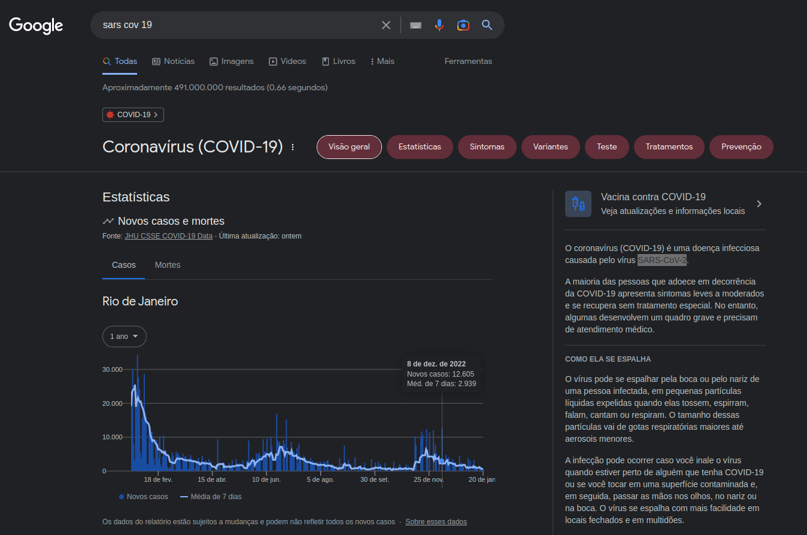

# Logbook

2023-01-21

Fui começar a organizar este projeto, fiz uma pesquisa no Google para verificar como se escreve o nome do vírus causador da COVID-19. Utilizei os termos sars cov 19, e entre os resultados foi exibido um gráfico de novos casos e mortes, cuja fonte resolvi verificar. Achei coisas interesssantes que poderão me poupar bastante tempo.

A fonte me levou para estes repositórios no Github:

1.  [COVID-19 Data Repository by the Center for Systems Science and Engineering (CSSE) at Johns Hopkins University](https://github.com/CSSEGISandData/COVID-19)

2.  [Número de casos confirmados de COVID-19 no Brasil](https://github.com/wcota/covid19br)
